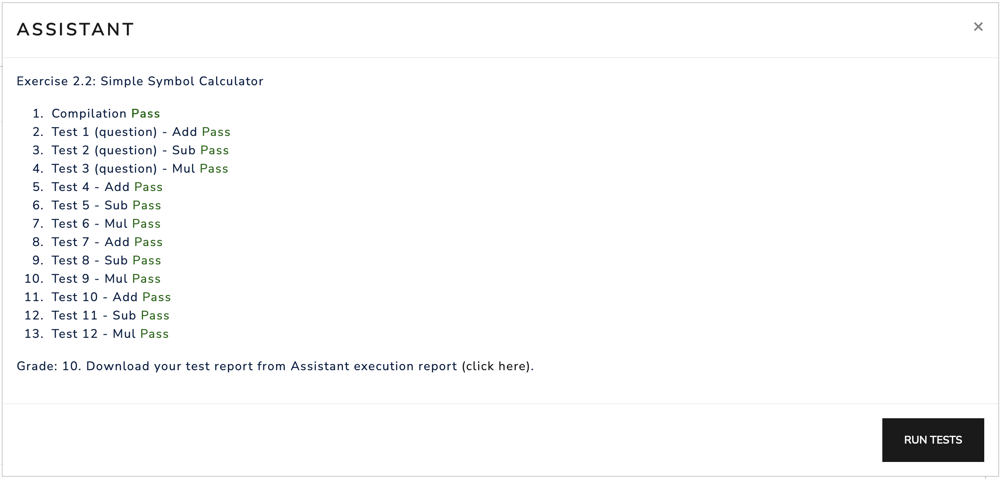

# [Section 2.2 - Using the Assistant to check a Simple Symbol Calculator program](https://riscv-programming.org/ale-exercise-book/book/ch02-02-using-assistant.html#using-the-assistant-to-check-a-simple-symbol-calculator-program)

### [Instructions](https://riscv-programming.org/ale-exercise-book/book/ch02-02-using-assistant.html#instructions)

You must write a C program that implements a simple calculator. The calculator must read a string from the Standard Input with the following format: **s1 op s2**, where **s1** and **s2** are symbols that have a value associated to them and **op** is the operation to be performed.

The symbols to be considered are the characters '0', '1', '2', '3', '4', '5', '6', '7', '8', and '9', and the values associated to them are zero, one, two, ..., and nine.

The arithmetic operations are represented by the symbols '+' (addition), '-' (subtraction) and '*' (multiplication).

### [Notes and Tips](https://riscv-programming.org/ale-exercise-book/book/ch02-02-using-assistant.html#notes-and-tips)

-  All inputs are 5-character strings, where the first character represents the first symbol, the second is a space, third determines the operation, fourth is a space, and the fifth character is the second symbol.
-  The test cases have values between 0 and 9 (just one digit) as outputs, so it is not necessary to implement a complete conversion function from integer to string (itoa).
-  Your program must be self-contained and cannot use library routines, not even C's standard library.

### [Using the Assistant](https://riscv-programming.org/ale-exercise-book/book/ch02-02-using-assistant.html#using-the-assistant)

We will be using the assistant from the RISC-V simulator for the first time in this exercise. It can be accessed via this [link](https://riscv-programming.org/ale/#select_url_content=TjRJZ3RnaGdsZ2RnK2dCd2djd0tZZ0Z3aEFHaEJBWndLZ0lCY0laUzRDQmpBSnlnVk14QUhwV0FDQVNUQVFIczZwRG9XSmtLUWlnQk1PQUd6N0prc1pCekI5SkFWeG1vQ0FIUmhSZUFvY0FDcVhPQUFsVU1oS2pvNE9BUVNJbHlsT0FHVjZqVWdGOE9BR1owZkdBY09pQUFkS3lxR2xvRXJDS3U0aEVBVnJvZ2VnYjhnaHpBQURKOE5CQXlBRXFvMlg2QndhSGhVVEdhMnF3MGZEQXdxRFNrVUMycDZRRGNlbm8wTWlJY0FLSUFIZ0JNY0pNY3FPT2txRENTQkU0dVl1NWVERXk1QXpBY0hNMHdaSFRxSFFJQUZBQ1V3SG9IQndUcXRuVFgtZnYzcEFBV0pCSHFVQndBWGc0YlFBN2h3ekpack04THVFSm5ZYUNSVUJ4SmhGSmhnT0I0c2xvTVFCUE1BQUl6NE1nNEFHRmlqUk5CQlNBSndsYzN2ZFpLZ2hIUnlrWkFjRFVHQ0NrVlNxekJLODdoOXZnUUlrYzJoMHVzY0lnaDFBUlBoY1dSVTZYc0dld3hqQUlQanNRUWNiUmlqSlZsSU9BUW1Sd3ZraUVNRmtIUUlLRXhEUUFOYUNnNWZINlcxQ1NWQUJXQWV1QVFPaklWWkFnRGE0UUF0R0hRVElvUGp3ZzV3MkdUYVFXY2c0MkVRQVFFQUNBQXpqQURzQURFaTBXU1dtRXlRSUdYOERSSk42d0k5d2dCZE43T3MzQzM1UUNJUVNTU09DTE1nd2tBa2tJSUtERFRvdE5Od1FFQVBseWlxTUVSWlluNWRJNExOSTZqbysxZElyUWJRWU5EZ3pWNFk5UWZlMHBHdXIxOERtQUFXZ01qZ3FIOU1oeDZPVDZsUXZtVk1GYmFzY0h0QWlnY1lQVE5TOWRIZUE0dENFZnNxQ2dhUWdRQVJsYlhjT3k3SHNMd0hBQURBQVZTOE9BQUVtQU9DNEFRZ0JxY2otQXVBQkhMOHlFbEs0T0RESndlMndodzBPSVhndEdmT2ppaWdVZ2NTd3E5c05tY2lPQUFaaDBQUjJJNGJDQUZacEpnV1RnQlBKQVdUZ0FKMUJnQ1VXblJDNElCd2ZFbUlCT2NJQWlaTURHdVFFZ1h4Q3lHREFhNGZ5dVZEMnorRERlemdpNDhJSTRqU0lvcWlPRm8raUp4Z0ppV0k4ZFI4Vmt6aXNYUFZBK09qUVRoTzh2Tm1JNFBNbE5rN0RzeXl1ODFQOWM4dEowMEw5TU00eloyRWV5ckpNMnpxc2NxNW5OY241M083VHpMMjgtQ3lDSWtqTHpJeVJLT291akwwWTlLQUZsTkJpOXN1SVFIaUV2VWZqa3E4N0NBQllPQUFLbVJQSzVJQURtMjFTUjBLelR0TjBtQXlxTWt5elBxNnlBVHF5eUdxYXY4b01DQVFncGdqaC1pQmJOZWcramdBQjVKSitxQktLWTI1bnVnMDBJSFpOQ2JXV1dBcjJ6SEFBRTVmd1pDR2hIeGFIMjFoeVI0WXVSR2tiRENBMXpDY0cyeGF6czJwU256dXI4dnFBdjhGakFNa0thZmhtdWJFb0VvVGx1SWlCLUhFNGo4VjhiYnNONThpaGYyZ3FOT0swN3pvcTB5cXZ1bTY3b2NweXJoY3Ntb2FCR0dwRHhnblViUnpIdGV4M1hLSHhuQmlmcE5HME5hekRscTZvUTZiSWZyQnZTeUxvbzQ2YTR0NGhha3U1anJSZUFQbjBzRjRXWkljUU9JRERDWHc5eUtXaXBPMHFndkt5N0ZkVjJxT0RzcFhHdlYxc0RpMThtUlJ4dldjQWtnMkdTTnd1bDFOaEhTLUxvVUtZODZtSFo2LXlCc0NsaUpwa1ZtUlhaK0xPYVdnUGVmOFRiUTVGM24xcGo1VDhzTzZYRThsT1hVLU03T2JNejY2YzQxaGxoYWVoa2JjN2IwTlNmWmROQ0VJRnB3VnNHMGZYUGxTQ1hHLVF4QVVqajVrVWgwa2JMSEc2ZjdRVDRJSzJHWGU2MDNZa1JmVC12Y0tBQVFncDd3c24xWityOWd6Wm5mZ0FRaStxRFBPOXgzcndEZ2tHS3U3a3Y2UEJmaUtMUU1Ca0JmRFFRY0FJcjBManZVK2h3SkNRTi1yQW1Fci1ENklOZGhrd1pJQXowSEJ5TEcwLWpBNytCRGd4UUdiR1FqZzI4cjRIRTRjQW9LVWlOcTBPekV4VGdGeE1FUVRERWhldUJ4eEZvd1hJSU8rRlFINEgyS0hBS1JUWjJSU0piR1RkNldvK0NWeDBiZmZjZGdxVG5qc1FLTW1HNHR6N0d3Z0FjUnRKNmRFeEVwRytBaUJ3QUFJbndFRU1BNURkZzREaVBnVzV3TGRUc1ZVRUlheFJCdUNFUE1kbzZoUXJYd3FQOUtHbndXUUJBQk1SRUVzQkpEaElpQ1lFb2VSUlFzaWNRQWVYeENrZG9wQnFsNUF1Tlk0eS1nS2tSS2laSUFFNFI1alRCUkhZOElNNExoRENnSTZEZ253N0NvQ3VIOUJJTTRJallWYk52UVVHejNqRnpObUFXQURoSURqRlFjOWR4MjRPQmpTcEo4Q0lBUTVDWEF1VjhhdXl3UWpXVTJoY1E1NlU5bGhXNFNvV0FCc3RsYk5CR01LWU14WEc0QkFFY2IweUJNQ2dENEV3U1VCQm9YZ3BhSkNzaUJBSUNPRXdKK1ZBZUFJVlFHUUtpaUFKSk1Xbkd4VWltQUtLS3doT0pWK0hGeUs4VUVvTE5TMGx1TDhVVmk0RXkybDVMNlVWakdoeXNsRkswVWVENVN5Z2xKZytWTEUxRHhBZ2ZCanh6TWRJU2NZZkxwWFVISUk2UkFmQjRaMkRnQUFOMktGK0ZndVpDekZnTEVTdkE4Tk5Jc2hvbkFXR2FBV0NUSGtpQVc4R1pkUThnTk5DcDFucHRYVE8wTzYzd3ZnZ0E=). When accessing the assistant, a new simulator tab will open with the configured Assistant available in the button below the *Debug* button.

To test your code, load the file (in this exercise the .c file) on the simulator and click on *Run Tests* after selecting the Assistant tab. The name of each one of the tests will be informed, and after some processing time, it will return either *Pass* or *Fail*, which can be selected to inform the input, expected output and returned output for the selected test.

### Files

[start.c](./start.c)

```c
void exit(int code) {
  __asm__ __volatile__("mv a0, %0           # return code\n"
                       "li a7, 93           # syscall exit (64) \n"
                       "ecall"
                       :           // Output list
                       : "r"(code) // Input list
                       : "a0", "a7");
}

void _start() {
  int ret_code = main();
  exit(ret_code);
}
```

[lib.c](./lib.c)

```c
/* read
 * Parameters:
 *  __fd:  file descriptor of the file to be read.
 *  __buf: buffer to store the data read.
 *  __n:   maximum amount of bytes to be read.
 * Return:
 *  Number of bytes read.
 */
int read(int __fd, const void *__buf, int __n) {
  int ret_val;
  __asm__ __volatile__("mv a0, %1           # file descriptor\n"
                       "mv a1, %2           # buffer \n"
                       "mv a2, %3           # size \n"
                       "li a7, 63           # syscall read code (63) \n"
                       "ecall               # invoke syscall \n"
                       "mv %0, a0           # move return value to ret_val\n"
                       : "=r"(ret_val)                   // Output list
                       : "r"(__fd), "r"(__buf), "r"(__n) // Input list
                       : "a0", "a1", "a2", "a7");
  return ret_val;
}

/* write
 * Parameters:
 *  __fd:  files descriptor where that will be written.
 *  __buf: buffer with data to be written.
 *  __n:   amount of bytes to be written.
 * Return:
 *  Number of bytes effectively written.
 */
void write(int __fd, const void *__buf, int __n) {
  __asm__ __volatile__("mv a0, %0           # file descriptor\n"
                       "mv a1, %1           # buffer \n"
                       "mv a2, %2           # size \n"
                       "li a7, 64           # syscall write (64) \n"
                       "ecall"
                       :                                 // Output list
                       : "r"(__fd), "r"(__buf), "r"(__n) // Input list
                       : "a0", "a1", "a2", "a7");
}
```

[calc.c](./calc.c)

```c
extern int read(int __fd, const void *__buf, int __n);
extern void write(int __fd, const void *__buf, int __n);

char input_buffer[255];
char output_buffer[2];

int char_to_int(char c) { return c - '0'; }

char int_to_char(int n) { return n + '0'; }

int main() {
  int n = read(0, (void *)input_buffer, 255);
  if (n > 0) {
    int s1 = char_to_int(input_buffer[0]);
    int s2 = char_to_int(input_buffer[4]);
    char op = input_buffer[2];
    int result;

    switch (op) {
    case '+':
      result = s1 + s2;
      break;
    case '-':
      result = s1 - s2;
      break;
    case '*':
      result = s1 * s2;
      break;
    default:
      write(1, "Invalid operation\n", 18);
      return 1;
    }

    output_buffer[0] = int_to_char(result);
    output_buffer[1] = '\n';
    write(1, output_buffer, 2);
  } else {
    write(1, "Error reading input\n", 20);
  }
  return 0;
}
```

### Compilation

```bash
riscv64-unknown-elf-gcc -S start.c -o start.s
riscv64-unknown-elf-gcc -S lib.c -o lib.s
riscv64-unknown-elf-gcc -S calc.c -o calc.s

riscv64-unknown-elf-as -c start.s -o start.o
riscv64-unknown-elf-as -c lib.s -o lib.o
riscv64-unknown-elf-as -c calc.s -o calc.o

riscv64-unknown-elf-ld start.o lib.o calc.o -o calc.x
```

## Uploading to Assistant

-  [x] Combine all code to single file: [all.c](./all.c)
-  [x] Upload file [here](https://riscv-programming.org/ale/#select_url_content=TjRJZ3RnaGdsZ2RnK2dCd2djd0tZZ0Z3aEFHaEJBWndLZ0lCY0laUzRDQmpBSnlnVk14QUhwV0FDQVNUQVFIczZwRG9XSmtLUWlnQk1PQUd6N0prc1pCekI5SkFWeG1vQ0FIUmhSZUFvY0FDcVhPQUFsVU1oS2pvNE9BUVNJbHlsT0FHVjZqVWdGOE9BR1owZkdBY09pQUFkS3lxR2xvRXJDS3U0aEVBVnJvZ2VnYjhnaHpBQURKOE5CQXlBRXFvMlg2QndhSGhVVEdhMnF3MGZEQXdxRFNrVUMycDZRRGNlbm8wTWlJY0FLSUFIZ0JNY0pNY3FPT2txRENTQkU0dVl1NWVERXk1QXpBY0hNMHdaSFRxSFFJQUZBQ1V3SG9IQndUcXRuVFgtZnYzcEFBV0pCSHFVQndBWGc0YlFBN2h3ekpack04THVFSm5ZYUNSVUJ4SmhGSmhnT0I0c2xvTVFCUE1BQUl6NE1nNEFHRmlqUk5CQlNBSndsYzN2ZFpLZ2hIUnlrWkFjRFVHQ0NrVlNxekJLODdoOXZnUUlrYzJoMHVzY0lnaDFBUlBoY1dSVTZYc0dld3hqQUlQanNRUWNiUmlqSlZsSU9BUW1Sd3ZraUVNRmtIUUlLRXhEUUFOYUNnNWZINlcxQ1NWQUJXQWV1QVFPaklWWkFnRGE0UUF0R0hRVElvUGp3ZzV3MkdUYVFXY2c0MkVRQVFFQUNBQXpqQURzQURFaTBXU1dtRXlRSUdYOERSSk42d0k5d2dCZE43T3MzQzM1UUNJUVNTU09DTE1nd2tBa2tJSUtERFRvdE5Od1FFQVBseWlxTUVSWlluNWRJNExOSTZqbysxZElyUWJRWU5EZ3pWNFk5UWZlMHBHdXIxOERtQUFXZ01qZ3FIOU1oeDZPVDZsUXZtVk1GYmFzY0h0QWlnY1lQVE5TOWRIZUE0dENFZnNxQ2dhUWdRQVJsYlhjT3k3SHNMd0hBQURBQVZTOE9BQUVtQU9DNEFRZ0JxY2otQXVBQkhMOHlFbEs0T0RESndlMndodzBPSVhndEdmT2ppaWdVZ2NTd3E5c05tY2lPQUFaaDBQUjJJNGJDQUZacEpnV1RnQlBKQVdUZ0FKMUJnQ1VXblJDNElCd2ZFbUlCT2NJQWlaTURHdVFFZ1h4Q3lHREFhNGZ5dVZEMnorRERlemdpNDhJSTRqU0lvcWlPRm8raUp4Z0ppV0k4ZFI4Vmt6aXNYUFZBK09qUVRoTzh2Tm1JNFBNbE5rN0RzeXl1ODFQOWM4dEowMEw5TU00eloyRWV5ckpNMnpxc2NxNW5OY241M083VHpMMjgtQ3lDSWtqTHpJeVJLT291akwwWTlLQUZsTkJpOXN1SVFIaUV2VWZqa3E4N0NBQllPQUFLbVJQSzVJQURtMjFTUjBLelR0TjBtQXlxTWt5elBxNnlBVHF5eUdxYXY4b01DQVFncGdqaC1pQmJOZWcramdBQjVKSitxQktLWTI1bnVnMDBJSFpOQ2JXV1dBcjJ6SEFBRTVmd1pDR2hIeGFIMjFoeVI0WXVSR2tiRENBMXpDY0cyeGF6czJwU256dXI4dnFBdjhGakFNa0thZmhtdWJFb0VvVGx1SWlCLUhFNGo4VjhiYnNONThpaGYyZ3FOT0swN3pvcTB5cXZ1bTY3b2NweXJoY3Ntb2FCR0dwRHhnblViUnpIdGV4M1hLSHhuQmlmcE5HME5hekRscTZvUTZiSWZyQnZTeUxvbzQ2YTR0NGhha3U1anJSZUFQbjBzRjRXWkljUU9JRERDWHc5eUtXaXBPMHFndkt5N0ZkVjJxT0RzcFhHdlYxc0RpMThtUlJ4dldjQWtnMkdTTnd1bDFOaEhTLUxvVUtZODZtSFo2LXlCc0NsaUpwa1ZtUlhaK0xPYVdnUGVmOFRiUTVGM24xcGo1VDhzTzZYRThsT1hVLU03T2JNejY2YzQxaGxoYWVoa2JjN2IwTlNmWmROQ0VJRnB3VnNHMGZYUGxTQ1hHLVF4QVVqajVrVWgwa2JMSEc2ZjdRVDRJSzJHWGU2MDNZa1JmVC12Y0tBQVFncDd3c24xWityOWd6Wm5mZ0FRaStxRFBPOXgzcndEZ2tHS3U3a3Y2UEJmaUtMUU1Ca0JmRFFRY0FJcjBManZVK2h3SkNRTi1yQW1Fci1ENklOZGhrd1pJQXowSEJ5TEcwLWpBNytCRGd4UUdiR1FqZzI4cjRIRTRjQW9LVWlOcTBPekV4VGdGeE1FUVRERWhldUJ4eEZvd1hJSU8rRlFINEgyS0hBS1JUWjJSU0piR1RkNldvK0NWeDBiZmZjZGdxVG5qc1FLTW1HNHR6N0d3Z0FjUnRKNmRFeEVwRytBaUJ3QUFJbndFRU1BNURkZzREaVBnVzV3TGRUc1ZVRUlheFJCdUNFUE1kbzZoUXJYd3FQOUtHbndXUUJBQk1SRUVzQkpEaElpQ1lFb2VSUlFzaWNRQWVYeENrZG9wQnFsNUF1Tlk0eS1nS2tSS2laSUFFNFI1alRCUkhZOElNNExoRENnSTZEZ253N0NvQ3VIOUJJTTRJallWYk52UVVHejNqRnpObUFXQURoSURqRlFjOWR4MjRPQmpTcEo4Q0lBUTVDWEF1VjhhdXl3UWpXVTJoY1E1NlU5bGhXNFNvV0FCc3RsYk5CR01LWU14WEc0QkFFY2IweUJNQ2dENEV3U1VCQm9YZ3BhSkNzaUJBSUNPRXdKK1ZBZUFJVlFHUUtpaUFKSk1Xbkd4VWltQUtLS3doT0pWK0hGeUs4VUVvTE5TMGx1TDhVVmk0RXkybDVMNlVWakdoeXNsRkswVWVENVN5Z2xKZytWTEUxRHhBZ2ZCanh6TWRJU2NZZkxwWFVISUk2UkFmQjRaMkRnQUFOMktGK0ZndVpDekZnTEVTdkE4Tk5Jc2hvbkFXR2FBV0NUSGtpQVc4R1pkUThnTk5DcDFucHRYVE8wTzYzd3ZnZ0E=)
-  [x] Run assistant
-  [x] Check report (how am I supposed to read this file...?)

