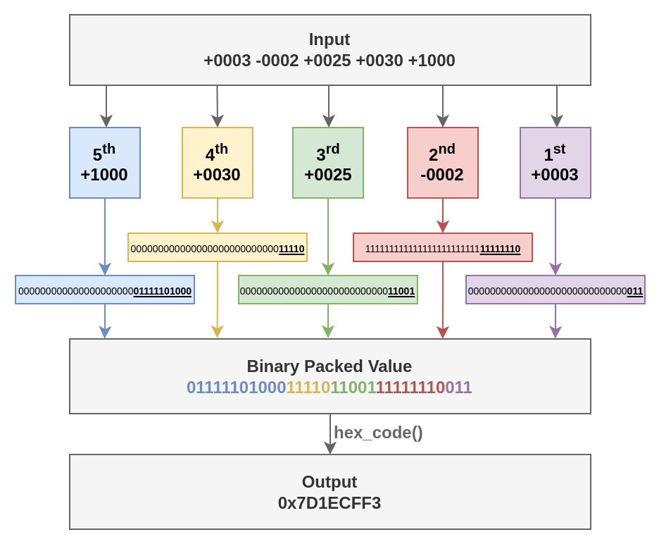

## [5.1 - Bit Masking and Shift Operations](https://riscv-programming.org/ale-exercise-book/book/ch05-01-bit-masking-shift-operations.html#bit-masking-and-shift-operations)

### [Instructions](https://riscv-programming.org/ale-exercise-book/book/ch05-01-bit-masking-shift-operations.html#instructions)

Write a C program that reads 5 numbers from the user input in decimal format and packs its bits to a single 32 bit value that will be written to the standard output as a hexadecimal value. The program should handle both positive and negative numbers.

A function with the signature **void pack(int input, int start_bit, int end_bit, int \*val)** might be a good start for this exercise.

The previously presented functions **read** and **write** can be used for reading/writing information from/to the standard input/output. The code snippet below can be used to write the resulting hexadecimal value to STDOUT (note that it uses the **write** function).

```c
void hex_code(int val){
    char hex[11];
    unsigned int uval = (unsigned int) val, aux;

    hex[0] = '0';
    hex[1] = 'x';
    hex[10] = '\n';

    for (int i = 9; i > 1; i--){
        aux = uval % 16;
        if (aux >= 10)
            hex[i] = aux - 10 + 'A';
        else
            hex[i] = aux + '0';
        uval = uval / 16;
    }
    write(1, hex, 11);
}
```

### [Input](https://riscv-programming.org/ale-exercise-book/book/ch05-01-bit-masking-shift-operations.html#input)

-  5 signed 4-digit decimal numbers separated by spaces (' '), followed by a newline character ('\n'). The whole input takes up 30 bytes.
   -  String Format - **"SDDDD SDDDD SDDDD SDDDD SDDDD\n"**
   -  **S**: sign, can be either '+' for positive numbers and '-' for negative.
   -  **D**: a decimal digit, (0-9)

### [Output](https://riscv-programming.org/ale-exercise-book/book/ch05-01-bit-masking-shift-operations.html#output)

After reading all 5 numbers, you must pack their least significant bits (LSB) following the rules listed below:

-  1st number: 3 LSB => Bits 0 - 2
-  2nd number: 8 LSB => Bits 3 - 10
-  3rd number: 5 LSB => Bits 11 - 15
-  4th number: 5 LSB => Bits 16 - 20
-  5th number: 11 LSB => Bits 21 - 31



Figure 5.1.1: Bit extraction from 5 32-bit inputs to constitute a single 32-bit output

### [Examples](https://riscv-programming.org/ale-exercise-book/book/ch05-01-bit-masking-shift-operations.html#examples)

| Test Case |             Input             |   Output   |
| :-------- | :---------------------------: | :--------: |
| 1         | -0001 -0001 -0001 -0001 -0001 | 0xFFFFFFFF |
| 2         | +0001 +0001 -0001 -0001 -0001 | 0xFFFFF809 |
| 3         | +0003 -0002 +0025 +0030 +1000 | 0x7D1ECFF3 |
| 4         | +9999 +9999 +9999 +9999 +9999 | 0xE1EF787F |

### [Notes and Tips](https://riscv-programming.org/ale-exercise-book/book/ch05-01-bit-masking-shift-operations.html#notes-and-tips)

-  You may use the C operator for bit manipulation (<<, >>, |, &, ^, …) to implement your function. Suggested readings:
   -  [Bit Operations](https://www.cs.cmu.edu/~ab/15-123S09/lectures/Lecture 17 -  Bit Operations.pdf)
   -  [Bitwise Operators](https://web.stanford.edu/class/archive/cs/cs107/cs107.1216/lectures/03/Lecture03.pdf)
-  You can test your code using the simulator's assistant from this [link](https://riscv-programming.org/ale/#select_url_content=TjRJZ3RnaGdsZ2RnK2dCd2djd0tZZ0Z3aEFHaEJBWndLZ0lCY0laUzRDQmpBSnlnVk14Q2pBUUhzN1NBQ1lIZ0tvQkpPQUFsVUFHd1NvNk9IZ0VFaUpjcFRnQmxlbzE0QmZIZ0RNNkhNRHdBNklBSFFCNk1Cd0FtQVZ3bW9DbHdzVElWUzVnRllFekFiaE1ZTms1dVBnQVpEaG9JQ1FBbFZGRFNYUU1qVXd0ck8wZG5TeG9PR0JoVUdsSW9QSjgtRUVDWUlKb0pOeDRBVVFBUEFGWTRBRVllVkViU1ZCaGJBZ1VsRDFVTkJpWStJSjRlWEpneU9uc2lyZ0FLQUVvSm1DbXBnbnRwT2xYS3paNVNBQXNTYzNzb0hnQmVIZ0tBZDBFUmNTa1pKYk1tbVJvU1ZCNW04emFNRHdBRUpRWGdBV1VJQUd0WU1nZUJSYkR3MUtjOUx3QVBLN0NERlBMbEZZSFRaT1hoMEJKY1hnM2U0OFNMUk9MRTdqN1NhYkU1bkdZRklvbFdibUJEMkFqSEpaRXhLNG9MMHFhTWdqbktEbUNDMld4d0hwa040YlE1cEFEQ1JnUVVGcVdLcXVDRm16ZzF3QWZPdEZacytTVHpFU1BMU0JRcmpVVFNQWTZCc1JlWTBBVUdEUTRMbDJPclVETG5LUlZuU2JadGRISWRWTitIcG9CSTRLZ0lIUUpBQlBRR2tlWS1iUTY2MkhIWE9pNFNxVit1WGh0SUFGWDlQQTZTd0FqdlotV3lWbVljTVhuY1IyRTVZeldZcURFNFdBOFdwbVlBTFFBQmxISFJIWTU0RStINDlITTZuYzdhSmtGMnVEMlpBdzhhQURFZDd1ZDh1dFUyMTV0K0Y2a0VTNEhwN0RCV1hsQVVzSURnQUVacks2R2lEbVZOc1ZiWEc1UHo4TUdBUDRac2VEYkJsbURLbktLZWFTdEtzcDlzZVpobG1RUEFBRXc4Tld0WmtQV2piTmxCNWl0Z2c3YW9KMkVqZHIyOHJHZ09JQUFOU0xqd2RHVHRPczVNWXVCNjRjZTFHYm51VzRBQnpEZ0FuT3hxNVVYdzB5cXZHdnBYamVtcjNvK0w0R25DQUhmcStmN0tVQmF3Z2NhWUdIQkJ3cjRUQkJid1pSaXBJZVdBRE1HRTFuV2VRTmlKaW90aUV4R2tlUnhuOW1rakhEcFowN29ZeHFITkF4bzdtY09ERnRIT3dsSHFKWmliZ0E3QUFJbTA5UktqdTVrUmU1cDRTUmUwbTNqQWNuUHErNzdxVCtWeHFWK0drOEZwaW82WnNlbEhBWjRxd1JSeFptU2hBQXNWbFlacWRtUlE1K0dFYzU5aGRxUVBadVp4SGtDUk5Ba01aTlUwMFROMDJUUXRFMXBXTjBXTlBVaVZiakZ2RXhWdUsyaVJsN0NTWmUxNDVYbENsdmtwWlhGYVZnSEFjVzFWVExWZWhjQmhCSThKY056TlA0SDA4QUFQRGNZVS1WQU5FMFdzd0RGdTlkRHdrWXZiWEhWWnl1akltSytzWnRYNldjaGx3ZjZKbkdnQUJzaHZBQUNUQUZBMmg0ejF4cU9XMnZva1lOWkhEVTFZMVRORGZTdy1CQURhdzRBTHFVMVJyTzJPei1vYzIwdlB1UkdaN0hkbHNrWWZKQlZYWGRxazhQKzEwckpWb21QVlZlSlRDQk9iMWVZZWl3REVjQVdvNHBJOEhxbDBRMk5wcmNPYU5La0J6Wmp3U2J6aG0rVTNQdzdtNG91NmJFaWtBUTJ1S3U5eURRN1lQdzNNT1FlSEZBZWdZZDduNytxNzJ6K3dRWE9ld0FoSkg0UGl6dzczd1BCQXczQW52dHU2bjVoT0RBeUFuTG5MMTBHOXFDOEo5RmJBLTl0eTlvSEgyZ3puek9iS0hrby1EUnhmNjZYS2NCeHpVRGM5SGlycTFSLWZoLURTenp6OEFCVUZiRG1zbGdZUVgtb0VJT2JUb3lHN20yMTRKOU95QWhzd01ieTltSjdOekwzaTdudlUrRWdjRSs4TW55NnZUSXowcnVKRUdvazdRT2cySGpBQTRtSFZBZ0lTYkwyME9ZSGdjVU9CM0JnSy1TVVBCRXdjQWRFY2NzSjk5Q0dHTUlvZHdLaGVCZEVLUFlUVS0wSUE4R09FU1BRVndTWjNGZ0lMTzQ1Z0JDeEhDT1llZ2NZZWlvaWZONFFvcEJXSGhDV0MtTithc2VCTU9RUndTVVZ3ekJkRmFHMGUyaVF6RDZpV0RVS0FOQklSVUprS2dGWWYxWEQ2bk1IallzbFZkWUtnRnJBQU1ZQllCeUVnSTBIdWh3Z0dPaDRCQ0U0QnRYN0xCY2NjYzBNTnlwcnlXTFlxY1BBckV3RFdEUklKc0FJS21LbU1jTG9ubzdDb0NXQUFOeGlDc2EyaHgzcjJHU1JJZUdXVDlSNUtqanFkNk1UR2p3ek1NSlNvT282NE55YnZES092MC1vOEY0c0RidWFUZzZOemhQWUVwTnhNa3hCNEFBVWdyQUFObW5ySFdXblNlRDZrQmh2ZHl4VDRacUMtRlhBMmVDbFRISGpDcWNPRDV4bURuWGd4SGdBQnllUWV5T0dyTG9PczFBOGdBd2IxQ1ZveG8wOUpBRUZRRE1yb2N5Rm5JQ1dVWUZaYXo0bWJKS1dFdlp3NGprMEJPV2NpNVN3cm03T0tkUEhwMlR1bFpKNEZ2Tm93eWRTejBjUnNOYVpnSVZkRHhGRW5nU0FORkxGZ0p5VWdjaExSVUNmS0NPUXZScFRrdUpUd0xKcVRDbnRNZ0FRVFJrYzVDY0R1REllR2JRZzVWS1dPOVp1ZFRMZ05LV0ZTdUFOTEFta3ZGYUNhNVBLdTVoSVpXTlpsbWloNjRzUVRJYWVVd09WY3BYamNWQ1FkWjZFcklUd0FBWkRjWlZRZGxYd3l0WDlCcFVxYVZCeU5lYkoxLTA3WGtHNE5LMGdRYzRWbW93Z0FQMlZiVk9GQUFmRzRUcWc2b3JwVEViRmdvRlJJMmhyLU5HUnA4VHRLeVZoZUdITXA2TXQ0QlFBZ25MNjZSeURnS21BUkxTa2dBQ05tNVdvSWk0OENkbU5MbWNoVUppM3JlWk9RWVZtMmlSRm0wTnR6UU8xVVJGb014dFBNK2FIQTVxaGJ0UEJ6S2l4MU56U3ByMStYdE1GYTNCcDMxNVU4RVZhSmZPcUJZVER6T09ZeWdZTEcySHltTzlPRnU3UlQ3c3VXMnVjeDZQcHh5V0FVSGRnTk5haVRQVk9MSm1xbzBTQ3doeUxrUEo2VUdybmZYQmROVEMzMU4rTTBoVnJUalNqS1NURUxDRTlQYVRKNEJ2YURva1BvbHVOYXF2Wk5FOW03UG1Rd0t1Y0h2M09FUXlzRGtrcDVueGdESzFPUS15OW5YTHczc3o5dWg3ay1EUTZKRjEySEJ4NGJDUVJtRVN4QnhwdEk1UGNqU0JiQlVkcExSLVpBTEdQN0pZKzVYTithdmI0VHhaQ1lqQ0hKNXlCcFduU2U2ZHRQVnNReUxYbWNKWmo1dHFqaWxtamRnRzFxZFFSTWlOQUVuRGprUHZSakI0OWx5R2RNVXVKR3lsTXlCV0ZtcW9Db1FLbVBKRTBlUlFaWTI0QkFETVEyeUJNQ2dBNEV3TmtCQUVzeGJ5SEZ1QUpBSUR5RXdLbVdzZUJZdFFHUUZsZ2dFQWxSNWJUSVZqTHhYU3NRRGlwVmdyNldZQ1pleTF1UnJxQnFzdGRxOWxvUUhXdXV0YksyQ2ZyelhCc1FEVUNOb3JKWHNzQ0JHNzBDQUw5ZlFFQTRKNkdKR2lud2NFYUNONWIxQnlBYU1RQndDeE1nNERDWllMRkhpRlc4QVdNdkVTS3NKc0tCb0JZUDVFQTJnOEFFRVRMUUdJRWhVc1lHQUs5a0E0ZEVucU9jQWw3UVlPZ0E=).


## Answers

```c
#define STDIN_FD 0
#define STDOUT_FD 1

typedef unsigned int uint32_t;
typedef signed int int32_t;

int read(int __fd, const void *__buf, int __n);
void write(int __fd, const void *__buf, int __n);
void hex_code(int val);
void exit(int code) __attribute__((noreturn));

void pack(int input, int start_bit, int end_bit, int *val) {
  int mask = (1 << (end_bit - start_bit + 1)) - 1;
  int shifted_input = (input & mask) << start_bit;
  *val |= shifted_input;
}

int parse_number(const char *str) {
  int num = 0;
  int sign = 1;
  if (*str == '-') {
    sign = -1;
    str++;
  } else if (*str == '+') {
    str++;
  }
  while (*str >= '0' && *str <= '9') {
    num = num * 10 + (*str - '0');
    str++;
  }
  return sign * num;
}

int main() {
  char input[30];
  read(STDIN_FD, input, 30);

  int numbers[5];
  char *ptr = input;
  for (int i = 0; i < 5; i++) {
    numbers[i] = parse_number(ptr);
    ptr += 6; // Move to the next number (5 digits + space)
  }

  int result = 0;
  pack(numbers[0], 0, 2, &result);   // 3 LSB
  pack(numbers[1], 3, 10, &result);  // 8 LSB
  pack(numbers[2], 11, 15, &result); // 5 LSB
  pack(numbers[3], 16, 20, &result); // 5 LSB
  pack(numbers[4], 21, 31, &result); // 11 LSB

  hex_code(result);
  return 0;
}

int read(int __fd, const void *__buf, int __n) {
  int ret_val;
  __asm__ __volatile__("mv a0, %1           # file descriptor\n"
                       "mv a1, %2           # buffer \n"
                       "mv a2, %3           # size \n"
                       "li a7, 63           # syscall write code (63) \n"
                       "ecall               # invoke syscall \n"
                       "mv %0, a0           # move return value to ret_val\n"
                       : "=r"(ret_val)                   // Output list
                       : "r"(__fd), "r"(__buf), "r"(__n) // Input list
                       : "a0", "a1", "a2", "a7");
  return ret_val;
}

void write(int __fd, const void *__buf, int __n) {
  __asm__ __volatile__("mv a0, %0           # file descriptor\n"
                       "mv a1, %1           # buffer \n"
                       "mv a2, %2           # size \n"
                       "li a7, 64           # syscall write (64) \n"
                       "ecall"
                       :                                 // Output list
                       : "r"(__fd), "r"(__buf), "r"(__n) // Input list
                       : "a0", "a1", "a2", "a7");
}

void hex_code(int val) {
  char hex[11];
  unsigned int uval = (unsigned int)val, aux;

  hex[0] = '0';
  hex[1] = 'x';
  hex[10] = '\n';

  for (int i = 9; i > 1; i--) {
    aux = uval % 16;
    if (aux >= 10)
      hex[i] = aux - 10 + 'A';
    else
      hex[i] = aux + '0';
    uval = uval / 16;
  }
  write(1, hex, 11);
}

void exit(int code) {
  __asm__ __volatile__("mv a0, %0           # return code\n"
                       "li a7, 93           # syscall exit (64) \n"
                       "ecall"
                       :           // Output list
                       : "r"(code) // Input list
                       : "a0", "a7");
}

void _start() {
  int ret_code = main();
  exit(ret_code);
}
```

